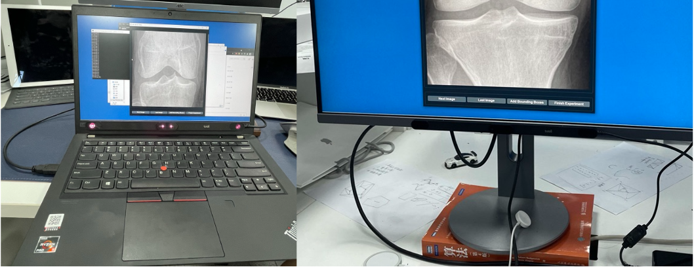
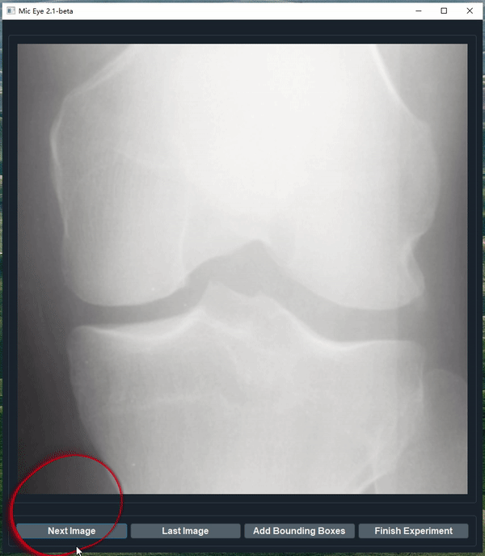

# 
<p align="center">
  
  <br/>
  
  <a href="https://jamesqfreeman.github.io/MicEye/">
      
  </a>
</p>

<!-- **M**edical **I**mage **C**omputing lab's **Eye**-tracker, or **MicEye**,  -->
<p align="center">
    Record radiologists' eye gaze when they are labeling images.
</p>

<!-- to label data and record eye gaze during 2D medical image viewing.  -->


Read  <a href="https://jamesqfreeman.github.io/MicEye/">
      
  </a>  for installation, usage, and deep learning examples.
## Why use MicEye

### Versatile
As a label tool, we support 

1. class label (keyboard typing)
2. bounding boxes (mouse draw)
3. keypoint label (use eye gaze)
   

During aforemention annotation process, all eye movement will be recorded.

### Cheaper
Start your research using less than 200 bucks! Comparing to other existing software, we use cheaper and more easily obtainable hardware, i.e., Tobii Eye Tracker 4C and Tobii Eye Tracker 5.

### Easier
Here we domonstrate some use cases, you can use it on the go with a laptop or use it on your desk monitor. It should be handful if you want to take it with you to collect data. Credit to Tobii's consumer product lineup, they did pack some really sick hardware in a small form factor.



And the code is easy to modify since it is PyQt.

### You can try it for fun!
I understand there are some better eye tracking software out there. However, they are too expensive and hard to use for someone who are trying for fun. And I do believe trying for fun is great, that's why I spent time to organize the code, add comments and docs even I know more thorough literature can be found. 

At beginning it was not a very serious idea during the pandemic lockdown to combine eye-tracking and medical image analysis (which is my PhD project). After some google search, I found the Tobii Eye-tracker are surprisingly affordable, so I bought it with my own money (my prof paid it soon after). There're no easy-to-use API so at the beginning I record the screen with a red bubble and post-process the video. And we started with the showing [cat/dog](deep_learning_example1.md) using PPT so every one in the lab are interesting to take part in. Then I wrap the c++ sdk in python and start to writing the program which become the MicEye now.

Linus Torvalds said he built Linux "just for fun". Hopefully, if you find this eye tracking things fun, MicEye could help you start something big.

## A demo
We domonstrate an example of radiologist reading knee X-Ray images. Of cause, you could use it in natural image. 



This red bubble is for demonstration, do not exist in real software. 

## In the future

- There will be a 3D version.
- There will be a version that support zoom and drag (coming very soon).

## Citation

```
@article{wang2022follow,
  title={Follow My Eye: Using Gaze to Supervise Computer-Aided Diagnosis},
  author={Wang, Sheng and Ouyang, Xi and Liu, Tianming and Wang, Qian and Shen, Dinggang},
  journal={IEEE Transactions on Medical Imaging},
  year={2022},
  publisher={IEEE}
}
```

## Contact me

Github issue or wsheng@sjtu.edu.cn
