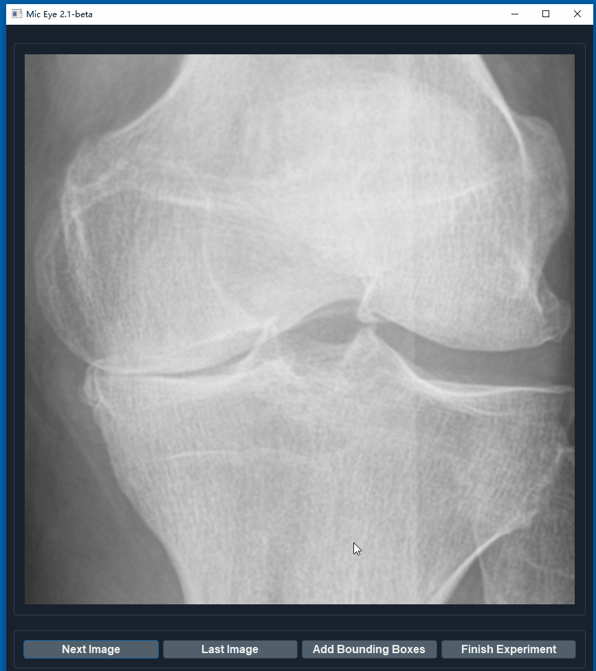

# Collect Data

## Calibrate
Use Tobii's software to do the calibration. I did try to write my own calibration but then I found Tobii's is great which even had a game to play (Now I can't find the game, seems like it is deleted). After the calibration, you can open MicEye by
```
python miceye.py
```

## Start collection

Place all the images in a same folder, then change the "image folder" option in  ```config.json```.

The data collection begin with typing the name down. And a message is shown to the volunteers to tell them how the experiment is setted up. You can modify the message at ```main.py```.


## Simply look
Just press the "Enter" for the next image. Gaze will be recorded.

## Type to label

This is for quantification/classification. For example, in knee X-Ray image, there is a quantification criteria named KL-Grade, range from 0 to 4, 0 means healthy and 4 is very ill. If do cat/dog classification, type 0 for cat and 1 for dog. It's on you.


## Draw bounding boxes

You can add bounding boxes by click "Add Bounding Boxes", then draw some boxes.
 


## Laser eye mode

It is a keypoint label, look at where you want label, and press "L" key.

## Save data

The gaze data is saved automatically after the experiment is finished.

In default setting, the data will be saved to ```logs/name year-month-day-hour-minute.csv```.

In the save file include multiple lines, each line include information seperated by semicolon, such as:

```
some-dir/9063823L.png;1;[[206, 412], [206, 412], [205, 411], ..., [105, 501]];[];(-1, -1)
```

It is orgnized by

```
image-location;class-label;[gaze-loc-1,gaze-loc-2,...,gaze-loc-n];[bbox_x1,bbox_y1,bbox_x2,bbox_y2];keypoint-loc
```

in which all the coordenate is the image coordinate system. For example, upper left of the image is ```[0,0]```.

## Config

We also provide ```config.json``` , so you can modify it.

```
{
  "image folder": "image folder",
  "save log to": "./logs",
  "random display order": true,
  "image height": 900,
  "loading wait": 3,
  "font": "Helvetica",
  "dark mode": true,
  "insta review": false,
  "guide mode": true
}
```

Other options should be pretty straight forward. Let me explain "insta review" and "guide mode". 

- "insta review" let you review the visualization of gaze when viewing the last image.

- "guide mode" display the annotation (if any) then display the image, this mode is for teaching which we are still working on.