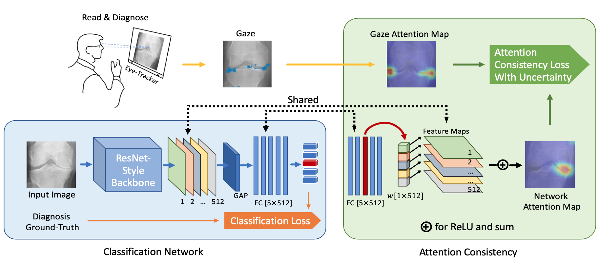
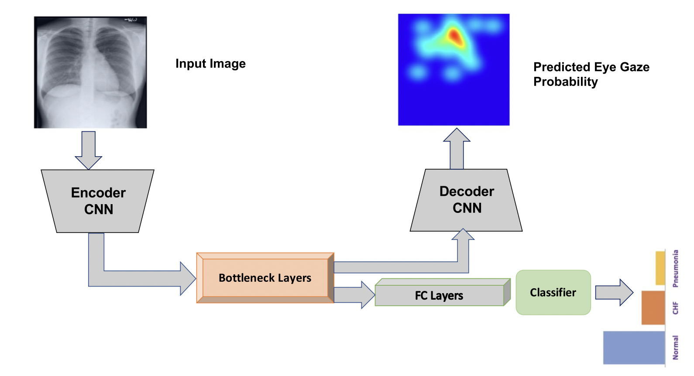

# Deep learning examples
In this page, we introduce how to utilize the collected gaze in deep learning tasks. Here we introduce two "static heatmap" methods, which means we do not take the order of the gaze into consideration.

## Human attention guide network attention

We implement a simple yet effective deep learning solution for utilizing the guidance from the radiologist’s gaze [3]. We demonstrate that the extra supervision from expert gaze can improve accuracy, robustness and interpretability of the CAD system. You can read our paper and following code for more detail. In short, we force the network to look at area where radiologist looked.


There is a very clean and short solution. Let me explain. In most current neural network, there is a GAP followed by a linear layer where a feature map is fed into it. We need to locate the 'feature map', as following we give an example of PyTorch's official ResNet implementation. We save the feature map, and then we get the weight of the linear layer. Then we just ```torch.nn.functional.conv2d``` them to get the result. However, usually we need the cam the same resolution as the image thus a interpolation is needed. You can use the following ```refine_cams``` function if you need.

If the ```F.conv2d #torch.nn.functional.conv2d``` seems like a black magic to you, you can read following explaination and refer to https://pytorch.org/docs/stable/generated/torch.nn.functional.conv2d.html for more detail. What we need is actually a element-wise dot product the feature map vector (i.e. a 1xC tensor) to corresponding linear's weight (i.e. a CxnClasses vec). The linear weight have a dim of CxnClasses, so we just need to dot product element-wise. That, is a 1x1 conv. Maybe now you can understand how the following code make sense. Plug it into your network and try!
```python
def refine_cams(cam_original, image_shape):

    if image_shape[0] != cam_original.size(2) or image_shape[1] != cam_original.size(3):
        cam_original = F.interpolate(
            cam_original, image_shape, mode="bilinear", align_corners=True
        )
    B, C, H, W = cam_original.size()
    cams = []
    for idx in range(C):
        cam = cam_original[:, idx, :, :]
        cam = cam.view(B, -1)
        cam_min = cam.min(dim=1, keepdim=True)[0]
        cam_max = cam.max(dim=1, keepdim=True)[0]
        norm = cam_max - cam_min
        norm[norm == 0] = 1e-5
        cam = (cam - cam_min) / norm
        cam = cam.view(B, H, W).unsqueeze(1)
        cams.append(cam)
    cams = torch.cat(cams, dim=1)
    sigmoid_cams = torch.sigmoid(100*(cams - 0.4))
    return cams, sigmoid_cams

def _forward_impl(self, x):
    # See note [TorchScript super()]
    x = self.conv1(x)
    x = self.bn1(x)
    x = self.relu(x)
    x = self.maxpool(x)

    x = self.layer1(x)
    x = self.layer2(x)
    x = self.layer3(x)
    fmap = self.layer4(x)
    x = self.avgpool(fmap)
    x = torch.flatten(x, 1)
    x = self.fc(x)
    weight = self.fc.weight
    cam = F.conv2d(fmap, weight.detach().unsqueeze(2).unsqueeze(3), bias=None)

    cams, sigmoid_cams = refine_cams(cam, self.image_shape)
    return x, cams, sigmoid_cams
```
## Multi-task

Karargyris et al.[1] offers a multi-task framework to utlize eye gaze information as the following figure demonstrated. The backbone have two task: 1. classfication and 2. predict human visual attention. Similiar framework can also be found at [2] where they use mouse instead of eye gaze.



## Reference

1. A.  Karargyris,  S.  Kashyap,  I.  Lourentzou,  J.  T.  Wu,  A.  Sharma,  M.  Tong,  S.  Abedin,D.  Beymer,  V.  Mukherjee,  E.  A.  Krupinskiet  al.,  “Creation  and  validation  of  a  chest  x-ray dataset with eye-tracking and report dictation for ai development,”Scientific data, vol. 8,no. 1, pp. 1–18, 2021.

2. L.Li,M.Xu,X.Wang,L.Jiang,andH.Liu,“Attentionbasedglaucoma detection: A large-scale database and cnn model,” in *Proceedings of the IEEE Conference on Computer Vision and Pattern Recognition*, 2019, pp. 10 571–10 580.

3. Wang, Sheng, Xi Ouyang, Tianming Liu, Qian Wang, and Dinggang Shen. "Follow My Eye: Using Gaze to Supervise Computer-Aided Diagnosis." IEEE Transactions on Medical Imaging (2022).

   
