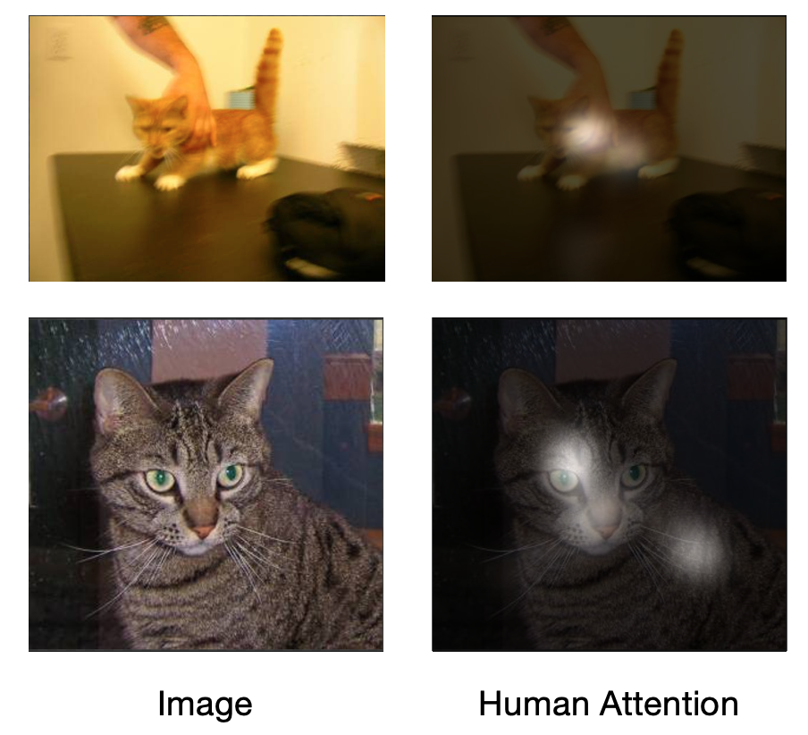
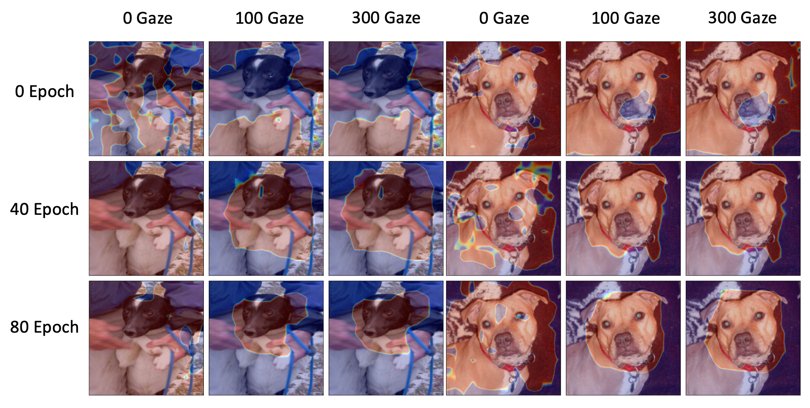
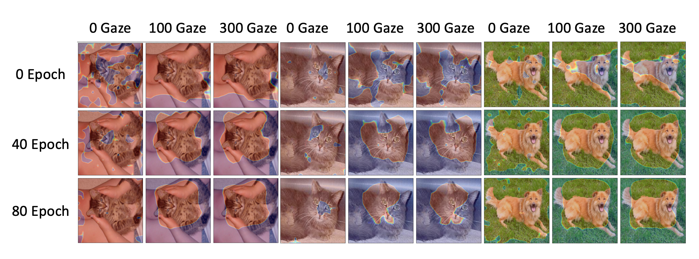
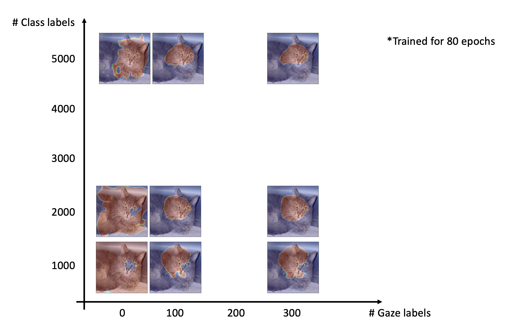

# Great computer vision paper must have a cat in it

## Task and data
At the start of this project (around May 2020), I start with Kaggle's [Cat vs Dog](https://www.kaggle.com/c/dogs-vs-cats) to validate the basic idea. Basically, it's a binary classification task to tell an image is cat or dog. And we collected a lot of eye gaze from our lab members.

The collected data is then used to train a network. This exploration did not reach the pushlish quality, but I believe it is worth to mention.

## Result
The image below is trained with 1000 training images.

Gotta love these cute little guys

And we try more class labels, then we found:

 for the network attetion (CAM), **more label=less label+gaze**.

You may notice we did not report the classification accuracy, because this problem is so easy for these networks, 95%+ acc can be easily achieved.
