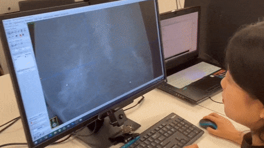
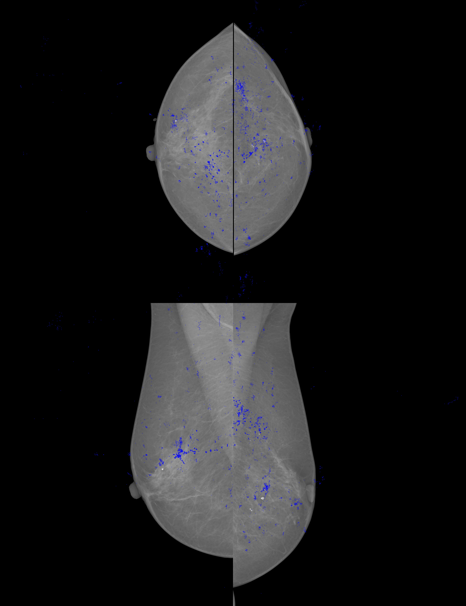

## Mammography & Eye-tracking
We are currently working on more image modalities: mammography, Chest X-Ray (Check out CXR project by Karargyris et al. as well: [CXR Eye Gaze](https://github.com/cxr-eye-gaze/eye-gaze-dataset).) and 3D CT and MR images.

Here is a demo on mammography, which demostrate the ability to use zoom and drag a DICOM image:

 

here are the gaze result for this video:

## About
This work is done by Chong Ma, Jiaming Xie and me at ShanghaiTech IDEA Lab. The volunteer in this video is Qiuyi Fu from Ruijin Hospital.