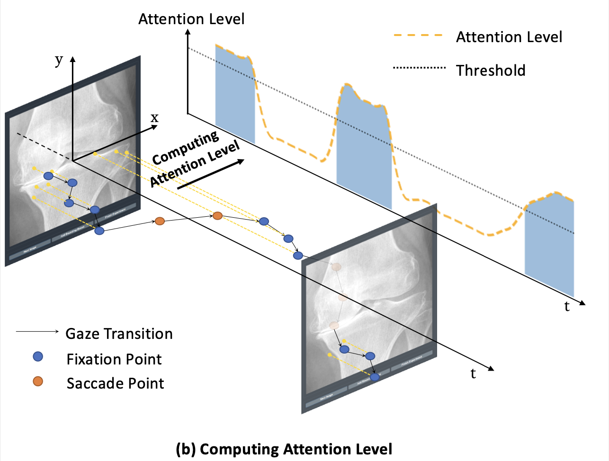

# Post process

## Find fixation with Levy Flight

Finding fixation is not a very simple task. Specially when there are some inter-obersver variance. We provide some solutions (we introduced one here, other methods can be found in code) that worked on our project. But we are not expert at this by any means. 



We calculate attention level using all points' stepsizes in a time window to calculate Levy Flight distribution's parameter.

```python
def levyDistribution(x, a):
    return a/(x*x)
  
def findLevyPara(stepsizes):
    res = np.histogram(stepsizes,
                       bins=np.linspace(0, 200, 100),
                       range=(0, 200),
                       density=True)
    prob = res[0]
    stepsize = res[1][1:]
    popt, _ = curve_fit(levyDistribution, stepsize, prob)
    return popt[0]
```


## To heatmap

Just "gaussian" it:

```python
def pointToHeatmap(pointList, gaussianSize=99, normalize=True, heatmapShape=(900, 900), offset=(0,0)):
    canvas = np.zeros(heatmapShape)
    for p in pointList:
        if p[1] < heatmapShape[0] and p[0] < heatmapShape[1]:
            canvas[p[1]+offset[1]][p[0]+offset[0]] = 1
    g = cv.GaussianBlur(canvas, (gaussianSize, gaussianSize), 0, 0)
    if normalize:
        g = cv.normalize(g, None, alpha=0, beta=1,
                         norm_type=cv.NORM_MINMAX, dtype=cv.CV_32F)
    return g
```

